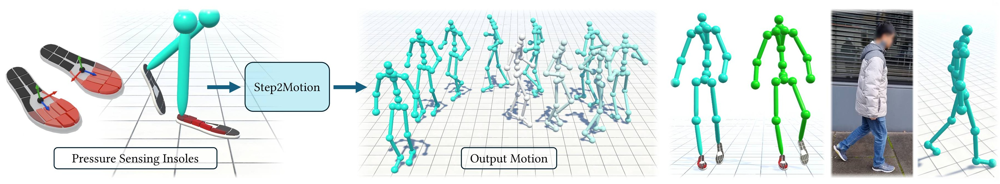

<div align="center">

## Step2Motion: Locomotion Reconstruction from Pressure Sensing Insoles </br> Eurographics 2026

[Jose Luis Ponton](https://joseluisponton.com/)<sup>1</sup>, [Eduardo Alvarado](https://edualvarado.com/)<sup>2</sup>, [Lin Geng Foo](https://lingeng.foo/)<sup>2</sup>, [Nuria Pelechano](https://www.cs.upc.edu/~npelechano)<sup>1</sup>, [Carlos Andujar](https://www.cs.upc.edu/~andujar)<sup>1</sup>, [Marc Habermann](https://people.mpi-inf.mpg.de/~mhaberma/)<sup>2</sup>

<sup>1</sup> [Universitat Politècnica de Catalunya (UPC)](https://www.upc.edu/en)  
<sup>2</sup> [Max Planck Institute for Informatics](https://www.mpi-inf.mpg.de/)

[**Project page**](https://vcai.mpi-inf.mpg.de/projects/Step2Motion/) | [**Paper (arXiv)**](https://arxiv.org/abs/2510.22712) | [**Video**](#) | [**Data**](#)



</div>

---

## Overview

Step2Motion is a system for reconstructing full-body locomotion from multi-modal insole sensors (pressure + IMU). It enables robust motion capture in unconstrained, real-world environments, without the limitations of traditional mocap suits or optical systems.

---

## Quick Start

> **Requirements:**  
> Python 3.9+  
> PyTorch (see [installation guide](https://pytorch.org/get-started/locally/))

1. Clone this repository.
2. Create and activate a virtual environment:
     ```bash
     python -m venv env
     .\env\Scripts\activate
     ```
3. Install dependencies:
     ```bash
     pip install -r requirements.txt
     ```
4. Install PyTorch as per your system configuration.

---

## Data

- **Process UnderPressure data:**
    Unzip the provided preprocessed UnderPressure data in the `data/UnderPressure/underpressure.zip` directory. If you want to process the raw BVH files yourself, you can use the src/process_underpressure.py script. Once unzipped, you should have a `data/UnderPressure/underpressure_test.pt` file with the processed data.

    ```bash

- **Process Step2Motion data:**

    - Download the dataset from ... TODO
    - TODO...
    
    ```bash
    py .\src\process_mpi.py mpi_dance ..\data\MPI\dancing\
    py .\src\process_mpi.py mpi_dance ..\data\MPI\dancing\ --xsens
    ```

## Testing

- **Predicting a single motion clip:**
    ```bash
    py .\src\test.py .\models\UnderPressure\ .\skeletons\UPSkeleton_S1_AMASS.bvh --dataset .\data\UnderPressure\underpressure_test.pt --clip 0
    ```
    This will produce a 'models/UnderPressure/predictions/underpressure_test_c0_pred.bvh' file with the predicted motion. You can visualize it using any BVH viewer (e.g., Blender) or using the Unity Visualization tool described below.

- **Predicting all test clips for a dataset:** 
    ```bash
    py  .\src\test_model.py .\models\UnderPressure\ .\data\UnderPressure\underpressure_test.pt .\skeletons\UPSkeleton_S4_AMASS.bvh --only_test
    ```

- **Visualize metrics:**
    With this script you can compute the metrics reported in the paper, with additional distribution visualizations. By default it computes the metrics for the UnderPressure model, assuming that predictions have been executed with the previous text_model script.

    ```bash
    py .\src\visualize_metrics.py
    ```

## Unity Visualization

 1. Install Unity Hub and Unity Editor (tested on version 2022.3).
 2. Open the Unity project in `Unity/InsopleVisualization/`. 
 3. In the Unity Editor, open the scene `Assets/Scenes/Visualizer.unity`. 
 4. Take a look at the GlobalManager_UP game object in the scene, which contains the configuration for loading the predicted BVH files. It references a scriptable object "UnderPressure" that contains a field "ModelsPath". Modify this absolute path to your local path where the models are stored (e.g., "C:/Users/user/Desktop/Step2Motion/models/").
 5. If you have executed the test_model script from before, you can see the results by pressing play in the Unity Editor.
 6. You can modify the GlobalManager_UP script to visualize different motion clips, for example, UnderPressure has 21 test clips, so you can change the prediction name like "underpressure_test_c0" to "underpressure_test_c1", etc.
 7. The InsoleManager game object contains some visualizatio and playback options.
 8. Once in play mode, you can press "I" to toggle the insole visualization, "SPACE" to start/stop the motion playback, "G" to focus on the ground truth, "P" to focus on the prediction, "S" to have a scene view, "scroll" to zoom in/out, "RIGHT and LEFT arrows" to advance frame per frame, "UP and DOWN arrows" to increase/decrease the playback speed, and "R" to restart the motion.

## Training

- **Train a model:**
    ```bash
    py .\src\train.py --config .\configs\config_underpressure.json
    ```

---

## Citation

If you use this project, please cite:

```bibtex
@misc{ponton2025step2motion,
            title={Step2Motion: Locomotion Reconstruction from Pressure Sensing Insoles}, 
            author={Jose Luis Ponton and Eduardo Alvarado and Lin Geng Foo and Nuria Pelechano and Carlos Andujar and Marc Habermann},
            year={2025},
            eprint={2510.22712},
            archivePrefix={arXiv},
            primaryClass={cs.GR},
            url={https://arxiv.org/abs/2510.22712}, 
}
```

---

## License

Code is released under the MIT License. See `LICENSE` for details.

---
