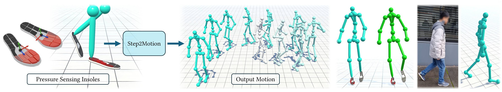

<div align="center">

## Step2Motion: Locomotion Reconstruction from Pressure Sensing Insoles </br> Eurographics 2026

[Jose Luis Ponton](https://joseluisponton.com/)<sup>1</sup>, [Eduardo Alvarado](https://edualvarado.com/)<sup>2</sup>, [Lin Geng Foo](https://lingeng.foo/)<sup>2</sup>, [Nuria Pelechano](https://www.cs.upc.edu/~npelechano)<sup>1</sup>, [Carlos Andujar](https://www.cs.upc.edu/~andujar)<sup>1</sup>, [Marc Habermann](https://people.mpi-inf.mpg.de/~mhaberma/)<sup>2</sup>

<sup>1</sup> [Universitat Politècnica de Catalunya (UPC)](https://www.upc.edu/en)  
<sup>2</sup> [Max Planck Institute for Informatics](https://www.mpi-inf.mpg.de/)

[**Project page**](https://vcai.mpi-inf.mpg.de/projects/Step2Motion/) | [**Paper (arXiv)**](https://arxiv.org/abs/2510.22712) | [**Video**](https://youtu.be/IPpb-YNyiSw?si=88HUgb_eihn2zfwl) | [**Data**](https://gvv-assets.mpi-inf.mpg.de/step2motion/)



</div>

---

## Overview

Step2Motion is a system for reconstructing full-body locomotion from multi-modal insole sensors (pressure + IMU). It enables robust motion capture in unconstrained, real-world environments, overcoming the limitations of traditional mocap suits or optical systems.

---

## Quick Start

### Requirements
- **Python:** 3.9+
- **PyTorch:** Follow the [official installation guide](https://pytorch.org/get-started/locally/) for your system.

### Installation

1. Clone this repository.
2. Create and activate a virtual environment:
     ```bash
     python -m venv env
     # On Windows:
     .\env\Scripts\activate
     # On macOS/Linux:
     # source env/bin/activate
     ```
3. Install dependencies:
     ```bash
     pip install -r requirements.txt
     ```
4. Install PyTorch according to your compute platform.

---

## Data Preparation

### 1. UnderPressure Data
Unzip the provided preprocessed UnderPressure data into the `data/UnderPressure` directory.  
*Outcome:* You should have a `data/UnderPressure/underpressure_test.pt` file.

To process raw BVH files manually (downloaded from the [official repository](https://github.com/InterDigitalInc/UnderPressure)):
```bash
python src/process_underpressure.py underpressure data/UnderPressure/
```

### 2. Step2Motion Data
1. Download the [Step2Motion dataset](https://gvv-assets.mpi-inf.mpg.de/step2motion/).
2. Unzip and place it in `data/step2motion/`. The structure should be:
    ```
    data/
    └── step2motion/
        ├── 00/
        │   ├── clip.bvh
        │   ├── clip.json
        │   └── clip.txt
        ├── ...
    ```
3. Run the processing script:
    ```bash
    python src/process_step2motion.py step2motion data/step2motion/ --seed 14
    ```

### 3. Dancing Data
The dance dataset is provided in the `data/dancing/` directory and is already preprocessed.

---

## Testing & Evaluation

### Predict a Single Motion Clip
Generate a prediction for a specific clip:
```bash
python src/test.py models/UnderPressure/ skeletons/UPSkeleton_S4_AMASS.bvh --dataset data/UnderPressure/underpressure_test.pt --clip 0
```
*Output:* `models/UnderPressure/predictions/underpressure_test_c0_pred.bvh`. This file can be viewed in Blender or the Unity Visualizer.

### Predict All Test Clips
Generate predictions for an entire dataset:
```bash
# UnderPressure
python src/test_model.py models/UnderPressure/ data/UnderPressure/underpressure_test.pt skeletons/UPSkeleton_S4_AMASS.bvh --only_test

# Dancing
python src/test_model.py models/dancing/ data/dancing/dance_test.pt skeletons/UPSkeleton_S1_AMASS.bvh --only_test

# Step2Motion
python src/test_model.py models/step2motion/ data/step2motion/step2motion_test.pt skeletons/step2motion.bvh --only_test
```

### Metrics & Visualization
Compute metrics and generate distribution plots reported in the paper. Choose the target dataset using the argument: `up` (UnderPressure), `dance`, or `step2motion`.

```bash
python src/visualize_metrics.py [up|dance|step2motion]
```

---

## Unity Visualization

1. **Setup:** Install Unity Hub and the Unity Editor (tested on version 2022.3).
2. **Open Project:** Open `Unity/InsoleVisualization/`.
3. **Load Scene:** Open `Assets/Scenes/Visualizer.unity`.
4. **Configuration:**
   - Select the `GlobalManager_UP` GameObject.
   - Locate the referenced `UnderPressure` ScriptableObject.
   - Update the **"ModelsPath"** field to the absolute path of your local models directory (e.g., `C:/Users/user/Desktop/Step2Motion/models/`).
5. **Playback:**
   - Press **Play** in the Editor.
   - To change clips, modify the prediction name (e.g., `underpressure_test_c0`) in the `GlobalManager_UP` script.
6. **Controls:**
   - `SPACE`: Play/Pause
   - `R`: Restart motion
   - `G`: Focus on Ground Truth
   - `P`: Focus on Prediction
   - `S`: Scene View camera
   - `I`: Toggle Insole visualization
   - `Scroll`: Zoom
   - `← / →`: Previous/Next frame
   - `↑ / ↓`: Increase/Decrease playback speed

---

## Training

To train a new model from scratch:
```bash
python src/train.py --config configs/config_underpressure.json
```

---

## Citation

If you use this project in your research, please cite:

```bibtex
@article{2026:ponton:step2motion,
  author = {Ponton, Jose Luis and Alvarado, Eduardo and Foo, Lin Geng and Pelechano, Nuria and Andujar, Carlos and Habermann, Marc},
  title = {Step2Motion: Locomotion Reconstruction from Pressure Sensing Insoles},
  journal = {Computer Graphics Forum},
  booktitle = {Eurographics 2026},
  volume = {45},
  number = {2},
  year = {2026},
  doi = {10.1111/cgf.70405},
}
```

---

## License

This code is released under the [MIT License](LICENSE).
